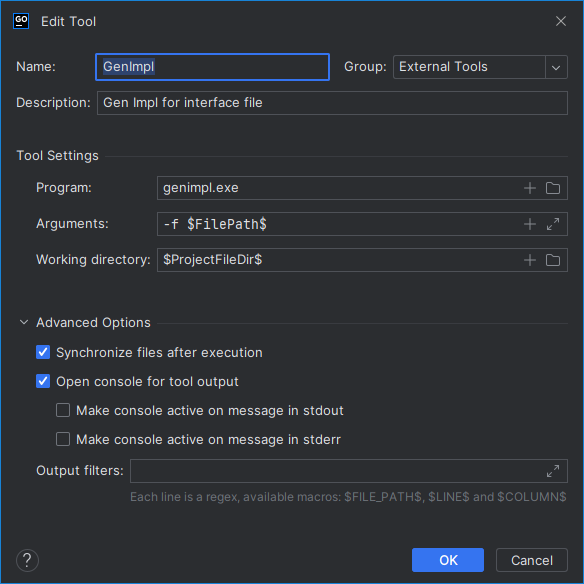

# go-gen
- 自动根据接口生成实现

## genimpl
1. 写一个接口文件
    ```go
    package manager
    
    var _ Manager = (*manager)(nil)
    
    type Manager interface {
        i()
    
        // GetByID 通过ID查找
        GetByID(id int64) (string, error)
    
        // GetByName 通过名称查找
        GetByName(name string) (string, error)
    
        // UpdateNameByID 通过ID更新名称
        UpdateNameByID(id int64, name string)
    
        // ListAll 查找所有
        ListAll() ([]*string, error)
    }
    
    type manager struct {
    }
    
    func New() Manager {
        return &manager{}
    }
    
    func (m *manager) i() {}
    ```
2. 执行生成实现
    ```shell
    go run ./impl/genimpl.go -f D:/workspace/test/manager.go
    ```
3. 会在指定的文件相同目录生成接口文件
    ```shell
      └── file :  D:/workspace/test/manager_getbyid.go
      └── file :  D:/workspace/test/manager_getbyname.go     
      └── file :  D:/workspace/test/manager_updatenamebyid.go
      └── file :  D:/workspace/test/manager_listall.go  
    ```
4. 生成代码示例
    ```go
    package manager

    func (m *manager) GetByID(id int64) (string, error) {
        // TODO: implement me
        panic("implement me")
    }
    ```
## 可以在golang中配置外部工具，然后就可以在文件右键，选择外部工具，然后就可以生成代码了
1. 生成可执行文件
   ```go
   go build ./impl/genimpl.go
   ```
2. 打开配置页面 Settings -> Tools -> External Tools
3. 新增外部工具，执行可执行文件（放到系统Path下，可以不用写目录）
   